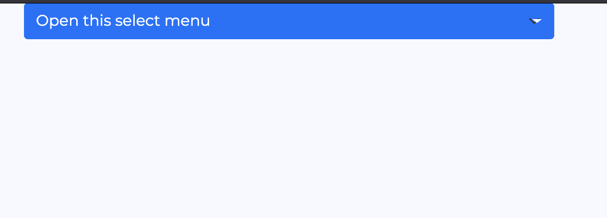
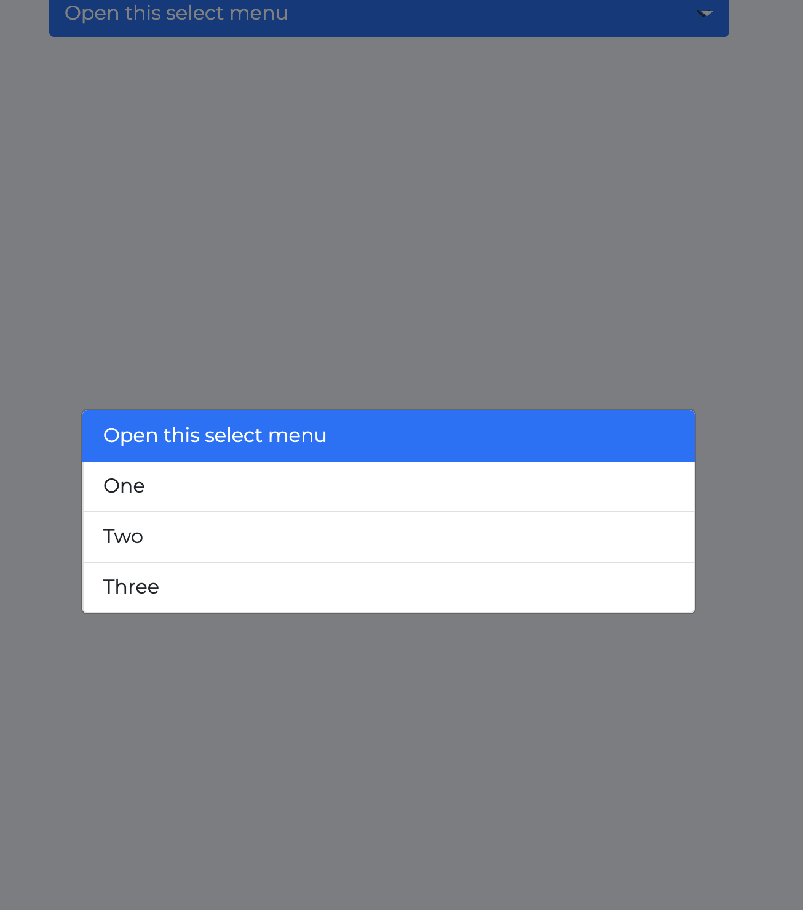

# Dropdown Modal
Make a dropdown with a modal view, ideal for touchscreens

### Installation
`npm i dropdown_modal`

### Usage
Import dropdown_modal
`var dropdown_modal = require('dropdown_modal')`

Add html select
```
 <select class="form-select btn-primary">
    <option value="0" selected>Open this select menu</option>
    <option value="1">One</option>
    <option value="2">Two</option>
    <option value="3">Three</option>
</select>
```

Note: every class you add to the select, will be replicated to the dropdown_modal

Initialize the dropdown modal
`$('select').dropdown_modal(options = {})`

To get the selected value, just do it as you normally would do it with a normal select
`$('select').val()`

### Options
- title:String - You can add a title to the modal
- modal_class:String - add a custom class/classes to the modal 

### Functions
- Refresh - `$('select').dropdown_modal('refresh')` Update the dropdown options
- Disable - `$('select').dropdown_modal('disable_button')` Disable dropdown button
- Enable - `$('select').dropdown_modal('enable_button')` Enable dropdown button

### Screenshot



### TODO
- Custom in-style width of the dropdown
- Custon in-style font size
- Optgroup

### Dependecies
- bootbox jstark518/bootbox
- bootstrap V5.1.3
- jQuery V3.6.0
